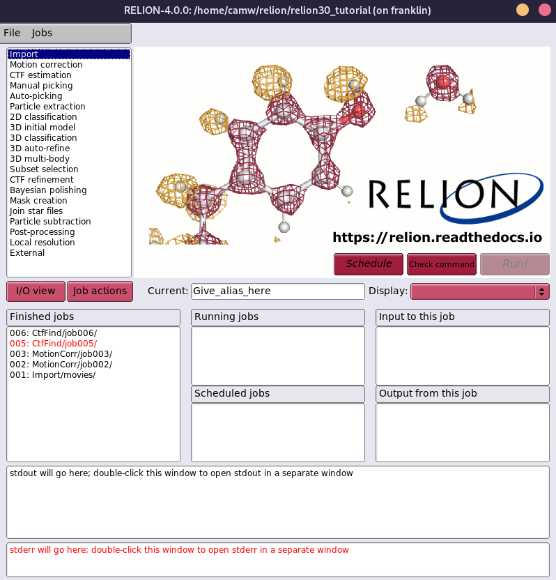
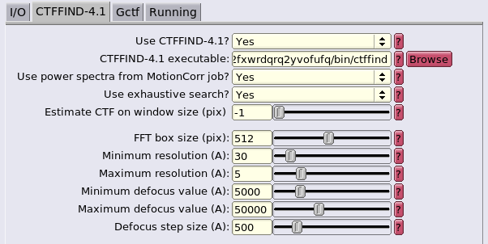
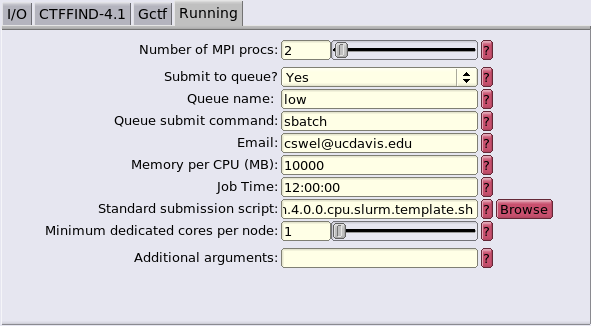
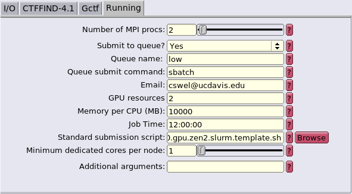

# :material-microscope: :material-dna: Cryo-EM Software Stack

## Relion

Franklin has multiple CPU and GPU optimized versions of the [Relion](https://relion.readthedocs.io/en/release-4.0/index.html) cryo-EM structural determination package.
The head node has been configured to support X11 forwarding, enabling the Relion GUI to be launched.
Relion jobs are submitted for batch processing on the cluster node via Slurm.
Each Relion module exports the necessary configurations to pre-fill job submission and dependency information in the GUI, and we have defined additional GUI fields to further configure Slurm parameters.
We are also maintaining an additional software package, [`relion-helper`](https://github.com/ucdavis/relion-helper), to assist users in switching between Relion modules within the same project.

Your first step is deciding which Relion variant you should use.
We recommend version **4.0.0**, as it is the currently-supported stable release.
There are three variants of this version: `relion/cpu/4.0.0+amd`, `relion/gpu/4.0.0+amd`, and `relion/gpu/4.0.0+intel`, which correspond to the CPU optimized, GPU with AMD CPU optimized, and GPU with Intel CPU optimized builds, respectively.
More information about these modules is available in the [Module Variants](cryoem.md#module-variants) section.
In general, unless you have access to the three GPU nodes owned by the Al-Bassam lab, you can ignore the Intel variants, and use the CPU `+amd` version for multi-node CPU only jobs and the GPU `+amd` version if you have access to a GPU node.

If you are completely unfamiliar with Relion, you should start with the [tutorial](https://relion.readthedocs.io/en/release-4.0/SPA_tutorial/index.html).

!!! Note
    Because Relion is GUI driven, you need to `ssh` to Franklin with X11 forwarding enabled.
    Instructions for enabling X11 forwarding can be found in the [Access](../general/access.md#x11-forwarding) section.

### Launching Relion

Make sure you have loaded one of the Relion modules:

```bash
$ module list relion

Currently Loaded Modules Matching: relion
  1) relion/gpu/4.0.0+amd   2) relion-helper/0.2
```

Change your working directory your Relion project directory and type `relion`.
The Relion GUI should then pop up locally.
There will be a bit of latency when using it, especially if you are off campus.
You may be able to reduce latency by [enabling SSH compression](../general/access.md#x11-forwarding).

<figure markdown>
  
  <figcaption>The relion start screen.</figcaption>
</figure>

### Dependency Configuration

The paths to software that different Relion jobs use will be *automatically filled in*.
Editing these paths, unless you really, *really* know what you are doing, is **not** recommended and will likely result in problems, as some of these
dependencies are compiled with architecture-specific flags that match their Relion variant.

<figure markdown>
  
  <figcaption>Pre-filled dependent program path.</figcaption>
</figure>

!!! danger
    If you plan to switch between Relion modules within the same project, **you must [use the procedure described in the relion-helper section](cryoem.md#switching-between-relion-modules-relion-helper)**.
    Failure to do so **will** result in execution errors.

### Slurm Configuration

Our Relion deployment has additional fields in the **Running** tabs.
These new fields are:

- **Email**: The email to which Slurm will send job status updates. Fills the `--mail-user` `sbatch`/`srun` parameter.
- **Memory per CPU**: Fills the Slurm `--memory-per-cpu` parameter. Total RAM use of a job will be *(Number of MPI procs)* \* *(Number of Threads)* \* *(Memory per CPU)*, when the **Number of Threads** field is available; otherwise it will be  *(Number of MPI procs)* \* *(Memory per CPU)*.
- **Job Time**: Fills Slurm's `--time` parameter.
- **GPU Resources**: Only available in the GPU modules. Number (and optionally type) of GPUs to request for this job. If only an integer is supplied, will request any GPU. If `TYPE:NUM` is supplied (example: `a4000:4`), specific models of GPU will be requested. See the [**Resources**](../scheduler/resources.md) section for more information on available GPU types.

=== "CPU Build"

    <figure markdown>
    
    <figcaption>The `relion/cpu` modules lack the GPU resources field. Note the submission script as well.</figcaption>
    </figure>

=== "GPU Build"

    <figure markdown>
    
    <figcaption>The `relion/gpu` module has an extra field for GPU resources. ALso note the differing submission script.</figcaption>
    </figure>

The default GUI fields serve their original purposes:

- **Number of MPI procs**: This will fill the Slurm `--ntasks` parameter. These tasks may be distributed across multiple nodes, depending on the number of **Threads** requested. For GPU runs, this should be the number of GPUs **+ 1**.
- **Number of Threads**: The will fill the Slurm `--cpus-per-task` parameter, which means it is the *number of threads per MPI proc*. Some job types do not expose this field, as they can only be run with a single-thread per MPI proc.
- **Queue name**: The Slurm partition to submit to, filling the `--partition` parameter. More information on partitions can be found in the [**Queueing**](../scheduler/queues.md) section.
- **Standard submission script**: The location of the Slurm job script template that will be used. This field will be filled with the appropriate template for the loaded Relion module by default, and should not be changed.*For advanced users only:* if you are familiar with Relion and want to further fine-tune your Slurm scripts, you can write your own based on the provided templates found in `/share/apps/spack/templates/hpccf/franklin` or [in our spack GitHub repo](https://github.com/ucdavis/spack-ucdavis/tree/main/templates/hpccf/franklin).
- **Minimum dedicated cores per node**: Unused on our system.

### Switching Between Relion Modules: relion-helper

### Module Variants

There are currently six variations of Relion available on Franklin.
Versions **3.1.3** and **4.0.0** are available, each with:

- A CPU-optimized build compiled for AMD processors: `relion/cpu/[VERSION]+amd`
- A GPU-optimized build compiled for AMD processors: `relion/gpu/[VERSION]+amd`
- A GPU-optimized build compiled for Intel processors: `relion/gpu/[VERSION]+intel`

The CPU-optimized builds were configured with `-DALTCPU=True` and without CUDA support.
For Relion CPU jobs, they will be much faster than the GPU variants.
The AMD-optimized `+amd` variants were compiled with `-DAMDFFTW=ON` and linked against the [`amdfftw`](https://github.com/amd/amd-fftw) implementation of  [`FFTW`](https://www.fftw.org/), in addition to having Zen 2 microarchitecture flags specified to GCC.
The `+intel` variants were compiled with AVX2 support and configured with the `-DMKLFFT=True` flag, so they use the [Intel OneAPI MKL](https://www.intel.com/content/www/us/en/develop/documentation/oneapi-programming-guide/top/api-based-programming/intel-oneapi-math-kernel-library-onemkl.html) implementation of `FFTW`.
All the GPU variants are targeted to a CUDA compute version of 7.5.
The full Cryo-EM software stack is defined in the HPCCF [spack configuration repository](https://github.com/ucdavis/spack-ucdavis/blob/main/environments/hpccf/franklin/cryoem/spack.yaml), and we maintain our own [Relion spack package definition](https://github.com/ucdavis/spack-ucdavis/blob/main/repos/hpccf/packages/relion/package.py).
More information on the configurations described here can be found in [the Relion docs](https://relion.readthedocs.io/en/release-4.0/Installation.html#configuration-options).

The different modules may need to be used with different Slurm resource directives, depending on their variants.
The necessary directives, given a module and job partition, are as follows:

 Module Name                     | Slurm Partition  | Slurm Directives         
---------------------------------|------------------|-----------------------------------
`relion/cpu/[3.1.3,4.0.0]+amd`   | `low`            | `--constraint=amd`
`relion/cpu/[3.1.3,4.0.0]+amd`   | `high`           | N/A
`relion/gpu/[3.1.3,4.0.0]+amd`   | `low`            | `--constraint=amd --gres=gpu:[$N_GPUs]` or `--gres=gpu:[a4000,a5000]:[$N_GPUs]`
`relion/gpu/[3.1.3,4.0.0]+amd`   | `jalettsgrp-gpu` | `--gres=gpu:[$N_GPUs]`
`relion/gpu/[3.1.3,4.0.0]+amd`   | `mmgdept-gpu`    | `--gres=gpu:[$N_GPUs]`
`relion/gpu/[3.1.3,4.0.0]+intel` | `low`            | `--constraint=intel --gres=gpu:[$N_GPUs]` or `--gres=gpu:[rtx_2080_ti]:[$N_GPUs]`
`relion/gpu/[3.1.3,4.0.0]+intel` | `jawdatgrp-gpu`  | `--gres=gpu:[$N_GPUs]`

For example, to use the CPU-optimized Relion module `relion/cpu/4.0.0+amd` on the free, preemptable `low` partition, you should submit jobs with `--constraint=amd` so as to eliminate the Intel nodes in that partition from consideration.
However, if you have access to and are using the `high` partition with the same module, no additional Slurm directives are required, as the `high` partition only has CPU compute nodes.
Alternatively, if you were using an AMD-optimized GPU version, like `relion/gpu/4.0.0+amd`, and wished to use 2 GPUs on the `low` partition, you would need to provide both the `--constraint=amd` and a `--gres=gpu:2` directive, in order to get an AMD node on the partition along with the required GPUs.
Those with access to and submitting to the `mmgdept-gpu` queue would need only to specify `--gres=gpu:2`, as that partition only has AMD nodes in it.

!!! NOTE
    If you are submitting jobs via the GUI, these Slurm directives will already be taken care of for you.
    If you wish to submit jobs manually, you can get the path to Slurm submission template for the currently-loaded module from the `$RELION_QSUB_TEMPLATE`
    environment variable; copying this template is a good starting place for building your batch scripts.


## ctffind

Our installation of [CTFFIND4](https://grigoriefflab.umassmed.edu/ctffind4) has `+amd` and `+intel` variants
which, like Relion, are linked against `amdfftw` and Intel OneAPI MKL, respectively.
The Slurm `--constraint` flags should be used with these as well, when appropriate, as indicated in the Relion directive table.
Each Relion module has its companion CTFFIND4 module as a dependency, so the appropriate version will automatically be
loaded when you load Relion, and the proper environment variables are set for the Relion GUI to point at them.

## MotionCor2

We have deployed [MotionCor2](https://emcore.ucsf.edu/ucsf-software) binaries which have been patched to link against the appropriate version of CUDA.
These are targetted at a generic architecture, as the source code is not available.
Like CTFFIND4, this module is brought in by Relion and the proper environment variables set for Relion to use it.

## Gctf

[Gctf](https://pubmed.ncbi.nlm.nih.gov/26592709/) binaries have been patched and deployed in the same manner as MotionCor2.
